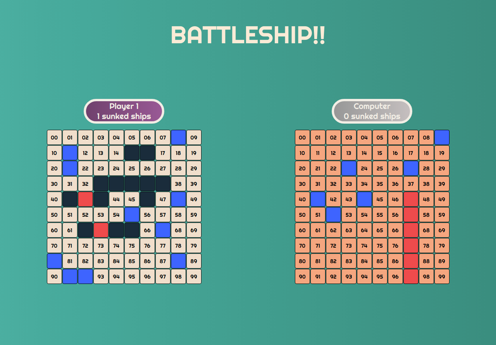
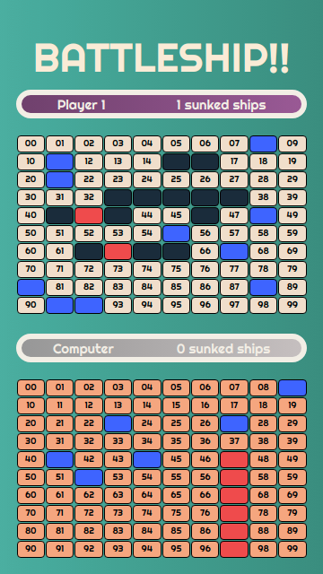

# 💻 Battleship game

<h2 align="center">Web View</h2>
  <p align="center">
  
  </p>
  <h2 align="center">Mobile View</h2>
  <p align="center">
  
  </p>

- A web app in which we implemented the [battleship](https://en.wikipedia.org/wiki/Battleship_(game)) game.

* This design of this project is an assignment that falls under the microverse curriculium:
  - [link to the assignment](https://www.theodinproject.com/courses/javascript/lessons/battleship)


### Technologies Used

In this app we used the following technologies:

HTML | CSS(SASS) | Javascript | Webpack
------------ | ------------- | ----------- | ----------- 
 |  |  | 


## ✨ Live Demo

You can look at it [here](https://rawcdn.githack.com/stratospherique/Restaurant-Page/55d3378c77cde88891db6f6470696973904f0a59/dist/index.html)

## 🚀 Getting Started

To get a local copy up and running follow these simple example steps.

### Clone

```sh
git git@github.com:stratospherique/battleship-js.git
cd battleship-js
```

### Install

```sh
npm install
```

### Usage

```sh
npm start
```

### Tests (JEST)
```sh
npm test
```

## Authors

👤 **Jorge Fernando Rincón Figueroa**

- Github: [@jofer86](https://github.com/jofer86)
- Twitter: [@JoferDev](https://twitter.com/JoferDev)
- Linkedin: [in/fernando-rincon-figueroa/](https://www.linkedin.com/in/fernando-rincon-figueroa/)


:male_detective: **Ahmed Mahfoudh**

- [Github](https://github.com/stratospherique)
- [Linkedin](https://www.linkedin.com/in/ahmed-mahfoudh/)
- [Twitter](https://twitter.com/AhmedMahfoudh8)
- [Email](mailto:ahmed.mahfoudh1991@gmail.com?subject=Website%20Inquiry)

## 🤝 Contributing

Contributions, issues and feature requests are welcome!

Feel free to check the [issues page](issues/).

## Show your support

Give a ⭐️ if you like this project!

> “There is no exercise better for the heart than reaching down and lifting people up.”
John Holmes
